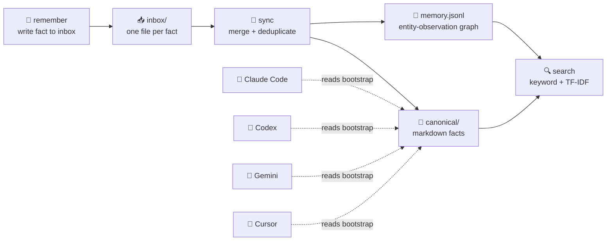

# AI Context Hub

<p align="center">
  <strong>Claude Code remembered it. Codex forgot it. This fixes that.</strong>
</p>

<p align="center">
  <a href="https://github.com/huyuanjun/ai-context-hub/blob/main/LICENSE"></a>
  <a href="https://www.npmjs.com/package/ai-context-hub"></a>
  <a href="https://github.com/huyuanjun/ai-context-hub/actions/workflows/ci.yml"></a>
  <a href="#"></a>
  <a href="#"></a>
</p>

AI Context Hub gives every AI coding tool a **single, shared long-term memory**. You teach Claude Code something about your codebase — Codex, Gemini, Cursor, and Windsurf all know it automatically. No more repeating yourself.

- **Zero dependencies** — pure Node.js built-in modules, nothing to install
- **Cross-platform** — Windows, macOS, Linux
- **Token-efficient** — ~50 tokens per query via grep-first access; never loads the full graph into context
- **Concurrency-safe** — file-locked inbox, atomic writes; multiple tools can write simultaneously

---

## Demo

```bash
$ ai-context remember "Payment module uses Stripe API v2, no v1 callbacks" --entity payment --confidence 1.0
Wrote inbox memory

$ ai-context remember "Backend on AWS us-east-1, RDS db.t3.xlarge" --entity infra
Wrote inbox memory

$ ai-context sync
{ "scannedFiles": 2, "added": 2 }

$ ai-context search "Stripe"
{ "mode": "keyword", "results": [...], "count": 1 }

$ ai-context search "database config" --semantic
{ "mode": "semantic", "results": [{ "text": "...RDS db.t3.xlarge", "score": 0.71 }] }

$ ai-context relate --from zhang-wei --to payment --kind works_on --apply
{ "status": "added", "relation": { "from": "zhang-wei", "to": "payment", "kind": "works_on" } }
```

Run it yourself: `bash demo/run.sh`

---

## Install

```bash
npm install -g ai-context-hub
```

Or run from source (no build step):

```bash
git clone https://github.com/huyuanjun/ai-context-hub.git
cd ai-context-hub
npm link        # or just put src/cli.js on your PATH
```

Requires Node.js >= 20.

---

## Quick Start

```bash
ai-context init                    # create ~/.ai-context
ai-context scan                    # detect existing AI tool configs
ai-context import                  # import existing bootstraps + skills
ai-context enable --dry-run        # preview what will change
ai-context enable --apply          # deploy shared context to all tools
```

Override data directory: `ai-context init --root /custom/path` or `export AI_CONTEXT_ROOT=/custom/path`

---

## How It Works



1. **`remember`** → writes one JSONL file per fact into `inbox/` — zero write conflicts
2. **`sync`** → lock → deduplicate (SHA256) → merge into canonical `.md` + entity graph
3. **AI tools** → find facts via bootstrap files using `grep`/`Select-String`, never load the full graph
4. **`search`** → keyword (instant substring) or semantic (TF-IDF + cosine similarity)

---

## AI Tool Support

`ai-context enable --apply` writes lightweight bootstrap files (~350 tokens each):

| Tool | Bootstrap | Skills |
|------|-----------|--------|
| Claude Code | `~/.claude/CLAUDE.md` | `~/.claude/skills/` |
| Codex | `~/.codex/AGENTS.md` | `~/.codex/skills/` |
| Gemini CLI | `~/.gemini/GEMINI.md` | — |
| Cursor | `.cursor/rules/shared-ai-context.mdc` | — |
| Windsurf | `.windsurf/rules/shared-ai-context.md` | — |
| Custom Agents | `~/.agents/AGENTS.md` | `~/.agents/skills/` |

Skills are symlinked, so a skill created once works in Claude Code, Codex, and Agents simultaneously.

---

## Data Layout

```text
~/.ai-context/
  config.json              ← hub configuration
  memory/
    inbox/                 ← staging: one JSONL file per fact
      claude/  codex/  manual/
    canonical/             ← merged markdown, one file per entity
      global.md            ← AI tool usage instructions
      preferences.md       ← user constraints
      payment.md           ← per-entity facts
    graph/
      memory.jsonl         ← entity-observation graph
      .search-index.json   ← cached TF-IDF index
  skills/                  ← shared skills (symlinked to each tool)
  backups/                 ← backup snapshots
  logs/                    ← structured JSONL logs
```

---

## Commands

| Command | Description |
|---------|-------------|
| `remember <fact>` | Write a fact to inbox |
| `sync` | Merge inbox → canonical + graph |
| `search <query>` | Keyword search (add `--semantic` for TF-IDF) |
| `context` | Compact context for AI prompt injection |
| `relate --from X --to Y --kind K` | Create entity relationship |
| `relations <entity>` | View entity's relationships |
| `remove-relation --id <id>` | Remove a relationship |
| `list` | List all entities |
| `expire` | Archive TTL-expired observations |
| `watch` | Continuous sync + index + validate loop |
| `schedule` | Generate OS scheduler scripts |
| `skills validate/index` | Manage skills |
| `link / adopt` | Deploy skills to AI tools |
| `enable` | Full rollout: validate → index → adopt → link → snapshot |
| `snapshot / history / restore` | Git-based version control of hub state |
| `backup create / list` | Backup snapshots |
| `doctor` | Full-system health check |
| `mcp` | Export MCP config snippets |

---

## Why Not Just a Shared File?

| Approach | Multi-Tool | Relations | Semantic Search | TTL | Token-Efficient |
|----------|-----------|-----------|-----------------|-----|-----------------|
| Shared `.md` file | partial | — | — | — | — |
| Environment variables | yes | — | — | — | yes |
| MCP memory server | partial | varies | varies | — | varies |
| **AI Context Hub** | **6 tools** | **6 kinds** | **TF-IDF** | **yes** | **50 tokens/q** |

---

## FAQ

**Is it safe to run `enable`?** It backs up existing configs before writing. Always review with `--dry-run` first.

**What if two tools write the same fact?** SHA256 dedup in `sync` catches duplicates.

**Does it work offline?** Yes. Everything is local.

**Why not use a database?** Zero-dependency is a design constraint. JSONL + grep scales to thousands of entities without a runtime.

**Where's my data?** `~/.ai-context/memory/` by default. Override with `--root` or `AI_CONTEXT_ROOT`.

---

## License

MIT — see [LICENSE](LICENSE).
